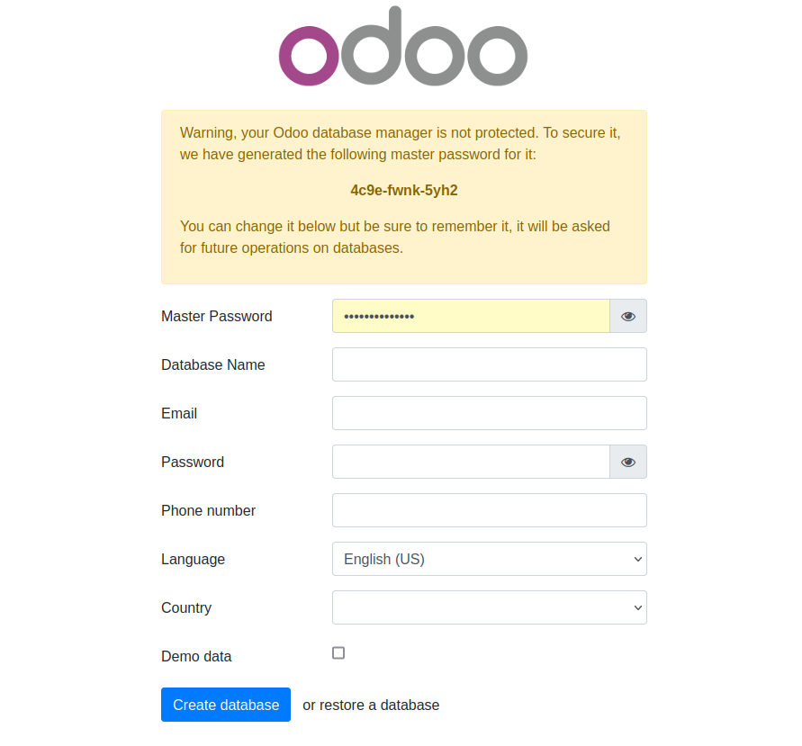
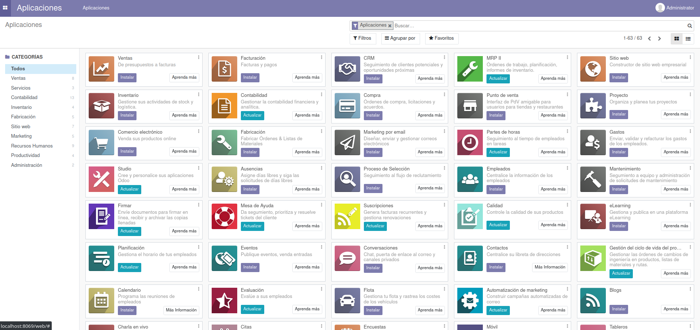

# Odoodock

Odoodock es un entorno de desarrollo de Odoo para Docker que sigue la idea propuesta por laradock. 

## Características

- Creación de imagen personalizada con la instalación de varias herramientas de apoyo.
- Soporte para _odoo_, _odoo shell_ y _scaffolding_
- Soporte de varios servicios de apoyo:
  - Moodle
  - MariaDB (para Moodle)
- Cada servicio corre en un propio contenedor.
- Permite el desarrollo desde dentro del contenedor de Odoo.
- Configuración de serie para realizar depuración en Visual Studio Code
- Fácilmente configurable a través de variables de entorno.
- Pensado con fines académicos: código muy comentado
- Soporte para versión 14

## Cómo empezar

### Requerimientos

- [git](https://git-scm.com/downloads)
- [docker compose](https://docs.docker.com/compose/)
- [Visual Studio Code](https://code.visualstudio.com/)

### Instalación

1. Crear la carpeta que contendrá todo lo necesario para el desarrollo los módulos de Odoo, por ejemplo _odoo_dev_

   ```
   mkdir odoo_dev
   ```

   > Nota: ten en cuenta que esta carpeta define un servidor de Odoo, en el que puede haber varios módulos en desarrollo.


2. Clonar en su interior _odoodock_

   ```
   cd odoo_dev
   git clone git@github.com:aoltra/odoodock.git
   ```

3. Entrar en la carpeta odoodock

   ```
   cd odoodock
   ```

4. Copiar el fichero _env-example_ a _.env_

   ```
   cp env-example .env
   ```

4. Modificar el fichero _.env_ para adapartalo a nuestras necesidades   

5. Copiar el fichero _services-example_ a _.services_

   ```
   cp services-example .services
   ```

6. Modificar el fichero _.services_ para incluir los servicios que deseamos arrancar. Los servicios se separan por espacios y van entrecomillados. 

   > El servicio _web_ es obligatorio para arrancar _odoo_

7. Asignar permisos de ejecución para el usuario al fichero _up.sh_

   ```
   chmod u+x ./up.sh
   ```

8. Arrancar los servicios

   ```
   ./up.sh
   ```

9. Para comprobar que todo ha ido correctamente, acceder desde un navegador a _localhost:8069_, donde debe aparecer la página del selector de la base de datos.

<center>



</center>

10. Configurar los valores y crear la base de datos

   > Es recomendable almacenar el _master password_ en un fichero aparte

11. Si todo ha ido correctamente, una vez finalizada la creación de la base de datos, deberá cargarse en el navegador la página _Aplicaciones_



### Insertando módulos

A. Crear un módulo con _odoo scaffold _

1. Entrar en el contenedor web. Para ello desde la carpeta _odoodock_ ejecutar:

   ```
   docker exec -it odoodock_web_1 bash
   ```

2. Dentro del contenedor ejecutar:

   ```
   odoo scaffold [nombre_del_modulo] /mnt/extra-addons
   ```

B. Clonar un módulo desde un repo existente

1. Entrar en el contenedor web. Para ello desde la carpeta _odoodock_ ejecutar:

   ```
   docker exec -it odoodock_web_1 bash
   ```
2. Dentro del contenedor, ir a la carpeta _/mnt/extra-addons_ y ejecutar:

   ```
   git clone [url_repo]
   ```

   > Si el repo es público y todavía no se ha configurado el acceso por _ssh_, lo mejor es utilizar _https_.


## Licencia

Odoodock se distribuye bajo licencia GPL 3. Más información en [LICENSE](LICENSE)